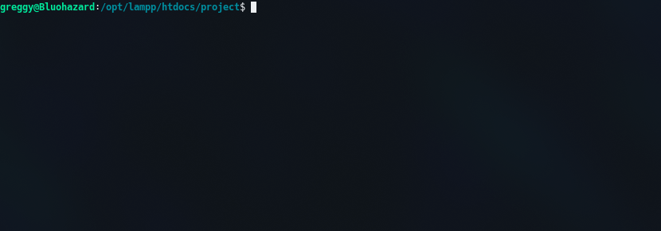

<!-- PROJECT LOGO -->
<br />
<p align="center">
  <a href="https://smk-nasional-malang.business.site/" target="_blank">
    
  </a>

  <h3 align="center">Sistem Informasi SMK Nasional Malang</h3>

> "Sistem Informasi Akademik SMK Nasional Malang" Website Application is a Website that is used to store a lot of information. Information that can be stored is Subjects, Majors, Competency Standards, Teachers, Students, Student Guardians, and Values. This application is expected to facilitate the work of Teachers / Admins in conducting data collection.

> This application was created for assignments on the 12th grade "Project" subjects.

</p>

<!-- TABLE OF CONTENTS -->
## Table of Contents

* [About the Project](#about-the-project)
* [Built With](#built-with)
* [Installation](#installation)
* [License](#license)
* [Contact](#contact)

<!-- ABOUT THE PROJECT -->
## About The Project

### Login Page


### Main Page


### Example Form Page


## Built With
* [PHP](https://www.php.net/)
* [JQuery](https://jquery.com)
* [MySQL](https://www.mysql.com/)

## Installation

1. Clone the repo
```sh
git clone https://github.com/bluohazard/sisinfo-smknas-mlg.git
```
<p align="center">
  
</p>

2. Import Database `database/sekolah.sql` to your PhpMyAdmin

3. Edit file `koneksi.php` adjust to your database connection. Example : 
```
$host = "localhost";    // MySQL host Url
$user = "root";         // MySQL user
$password = "";         // MySQL password
$database = "sekolah";  // database name
```

<!-- LICENSE -->
## License

Distributed under the MIT License. See `LICENSE` for more information.

<!-- CONTACT -->
## Contact

Greggy Gianini Firmansyah - [@greggygf](https://instagram.com/GreggyGF) - greggygf@gmail.com